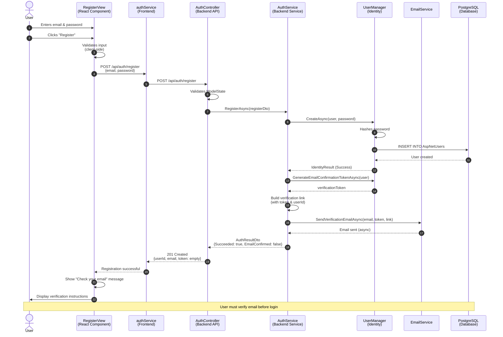
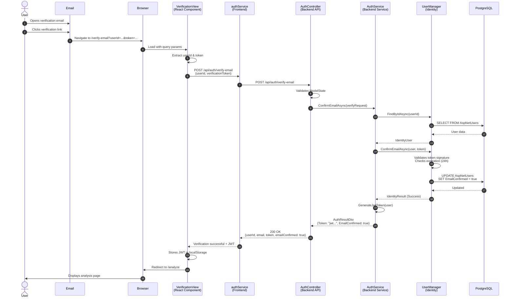
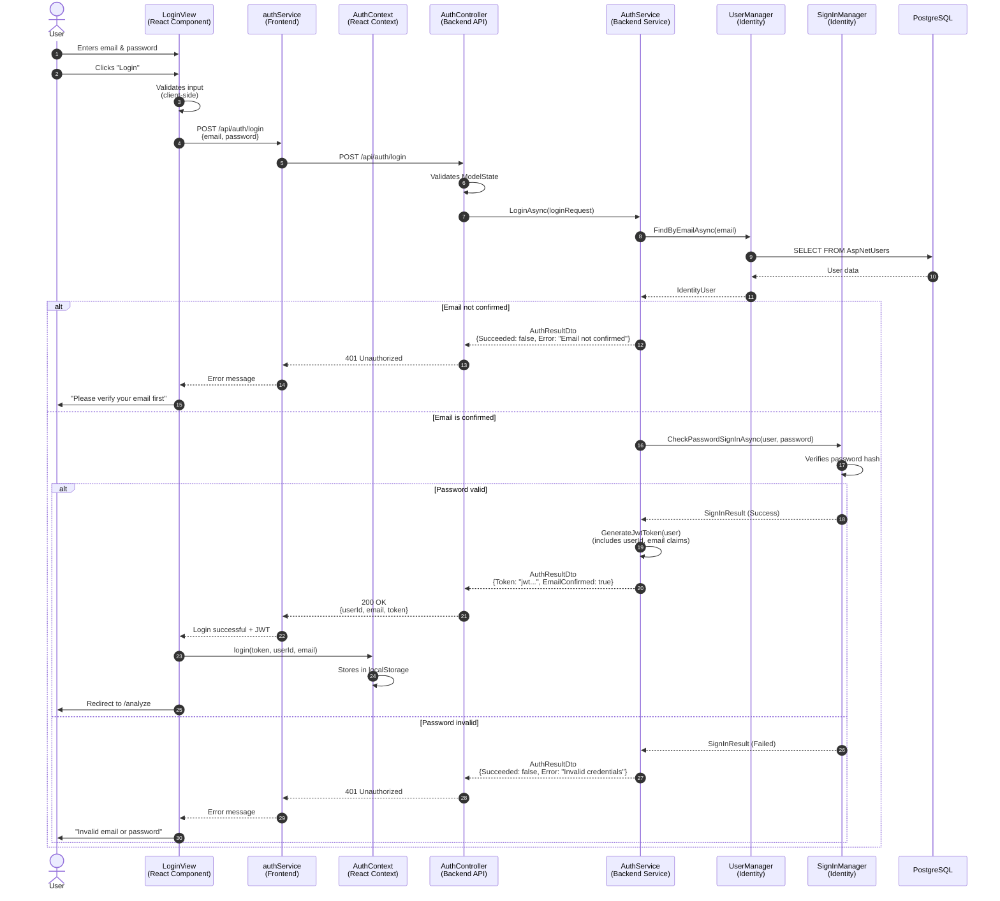
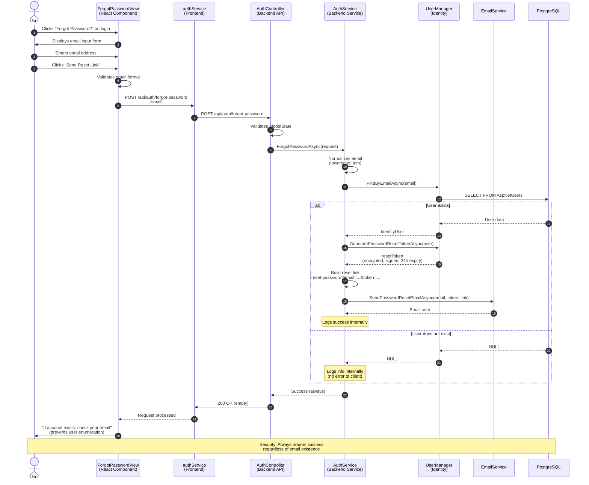
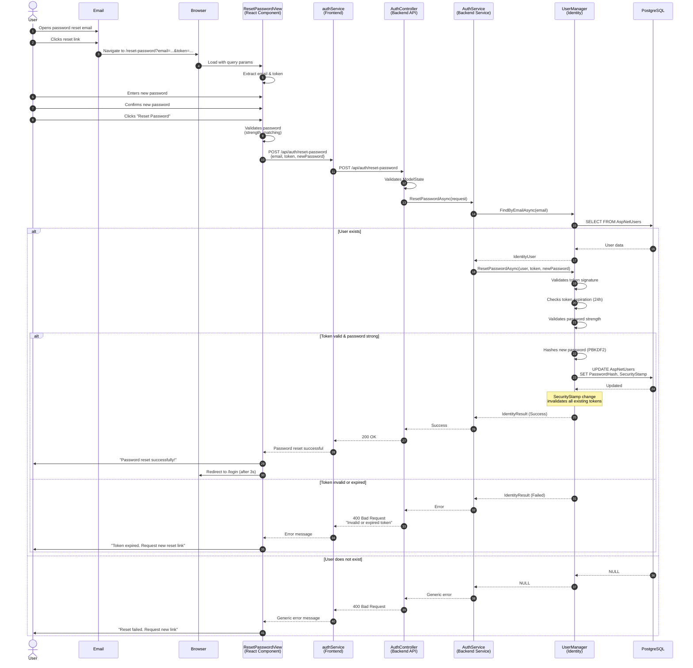
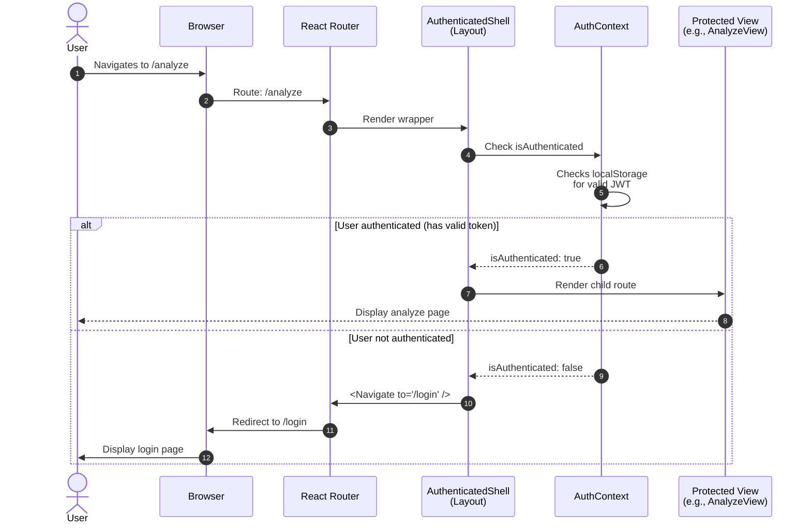
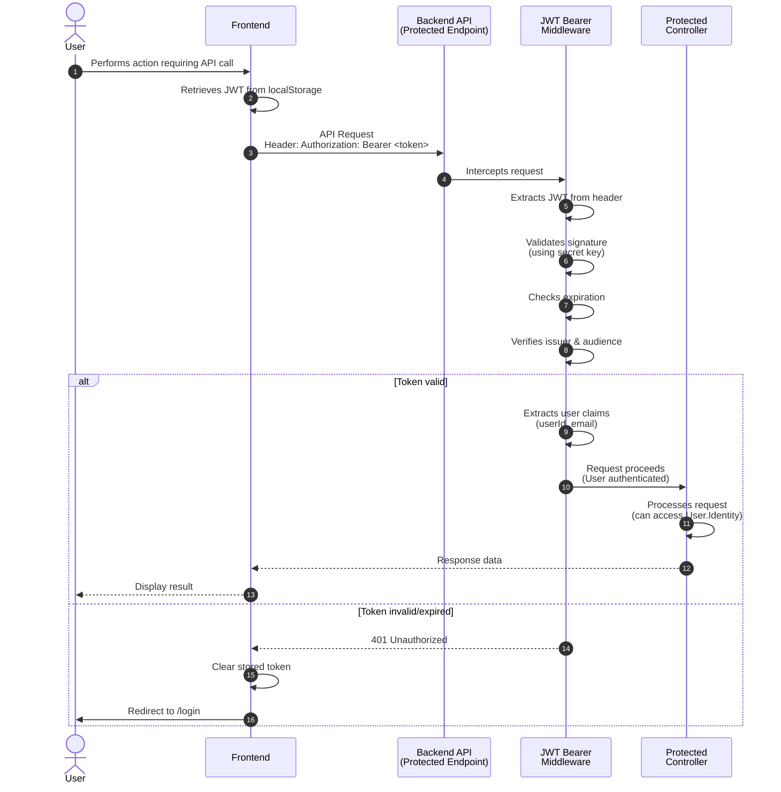
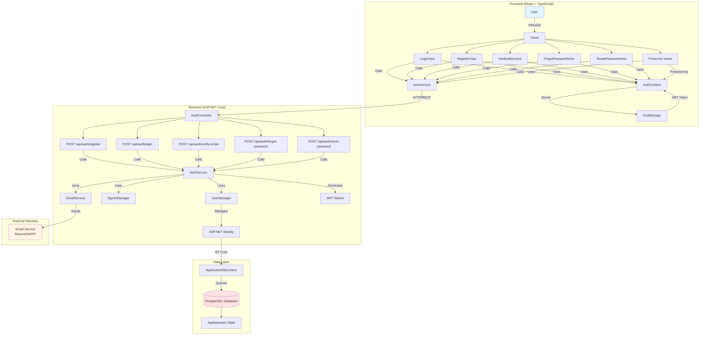
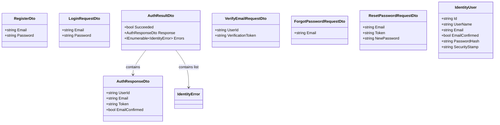

# Authentication Flow Diagrams

## Overview
This document contains Mermaid diagrams illustrating the authentication flows for the PetFoodVerifAI application, based on the authentication specification and PRD.

---

## 1. User Registration Flow (US-001)

---

## 2. Email Verification Flow

---

## 3. User Login Flow (US-002)

---

## 4. Forgot Password Flow (US-003 - Part 1)

---

## 5. Reset Password Flow (US-003 - Part 2)

---

## 6. Protected Route Access Flow

---

## 7. JWT Token Authentication Flow

---

## 8. Architecture Overview

---

## 9. Data Models Overview

---

## Security Considerations

### 1. Password Security
- All passwords hashed using PBKDF2 with salt (ASP.NET Identity default)
- Never stored or transmitted in plaintext
- Password strength requirements enforced

### 2. Token Security
- JWT tokens signed with secret key
- Tokens include expiration claims
- Email verification tokens are encrypted and signed
- Password reset tokens expire after 24 hours
- Single-use tokens (security stamp changes after use)

### 3. User Enumeration Prevention
- Forgot password endpoint always returns 200 OK
- Generic error messages for failed login
- No indication of whether email exists

### 4. Transport Security
- All endpoints must use HTTPS in production
- JWT transmitted in Authorization header

### 5. Rate Limiting (Recommended)
- Implement rate limiting for login attempts
- Implement rate limiting for forgot password requests
- Account lockout after failed login attempts

---

## Notes

- **US-001**: User Registration - Implemented with email verification requirement
- **US-002**: User Login - Implemented with email confirmation check
- **US-003**: Password Recovery - Specified but not yet implemented in current codebase
- All endpoints follow RESTful conventions
- Frontend uses React Router for navigation
- Authentication state managed via React Context
- JWT tokens stored in localStorage (consider httpOnly cookies for enhanced security)

